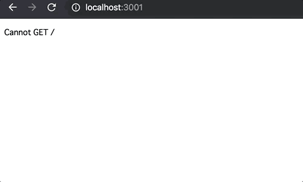

# レポジトリ内容

このレポジトリは[Web白熱教室](https://tsuyopon.xyz/)の[JavaScriptの学習コンテンツ > JavaScriptバックエンド編](https://tsuyopon.xyz/learning-contents/web-dev/javascript/backend/)にある「[【エクササイズ】express.Routerを使って2ページ分のルーティングを実装する](https://tsuyopon.xyz/learning-contents/web-dev/javascript/backend/js-excercise-for-backend-5/)」で利用するものです。

### 完成形

## 課題

- 以下の「課題をクリアするためのステップ」の内容を全て対応する
- 対応後、ターミナルで「npm start」を実行してサーバー起動後、完成形と同じような表示をブラウザで確認できるようにする

### 課題をクリアするためのステップ

1. [ ] package.jsonを作る
1. [ ] node_modulesをgitのバージョン管理から除外する
1. [ ] 必要なライブラリをインストールする
    - [ ] [express](https://github.com/expressjs/express) を `dependencies` にインストールする
    - [ ] [nodemon](https://github.com/remy/nodemon) を `devDependencies` にインストールする
1. [ ] package.jsonのscriptsを修正して「npm start」で `nodemon app.js` が実行されるようにする
1. [ ] プロジェクトのルートディレクトリ直下に `app.js` を作成する
1. [ ] プロジェクトのルートディレクトリ直下に `router` ディレクトリを作成する。そして、その後、 `router` ディレクトリ内に `index.js` を実装する
1. [ ] `app.js` の実装内容は以下の通り
    - [ ] `router/index.js` を `require` で読み込む
    - [ ] `router/index.js` を使って `GET /pages`、 `GET /pages/about` にアクセスがあったときに、 `router/index.js` で実装したルーティング処理が実行されるようにする
    - [ ] サーバー起動時のポート番号は `3001` とする
1. [ ] `router/index.js` の実装内容は以下の通り
    - [ ] `router.get('/')` のときは、ブラウザに「トップページです！」という表示がされるようにする
        - ヒント : https://expressjs.com/ja/4x/api.html#res.send
        - 注意 : `router.get('/')` の実装をしているが、実際には `/pages` にアクセスがあったときに「トップページです！」と表示されるようにする
            - `app.js` の実装に注意する
    - [ ] `router.get('/about')` のときは、ブラウザに「アバウトページです！」という表示がされるようにする
        - ヒント : https://expressjs.com/ja/4x/api.html#res.send
        - 注意 : `router.get('/about')` の実装をしているが、実際には `/pages/about` にアクセスがあったときに「アバウトページです！」と表示されるようにする
            - `app.js` の実装に注意する
    - [ ] `router`を `module.exports` して、外部ファイルから `router` を読み込めるようにする
1. [ ] `npm start` でサーバーを起動して、以下の表示がされることを確認する
    - [ ] `localhost:3001/pages` にアクセス → 「トップページです！」とブラウザに表示される
    - [ ] `localhost:3001/pages/about` にアクセス → 「アバウトページです！」とブラウザに表示される

## 答え

このレポジトリの `answer` ブランチに答えを用意しているので、そちらを参考にしていただけたらと思います。

## 参考記事

課題をこなしていて、行き詰まったら以下の資料を参考にしていただければ解答にたどり着けるかと思います。

- Web白熱教室
    - [expressをインストールする【Node.jsのフレームワーク】](https://tsuyopon.xyz/learning-contents/web-dev/javascript/backend/install-the-express-with-npm/)
    - [【express】サーバーを起動する【ホスト・ポート番号とは？】](https://tsuyopon.xyz/learning-contents/web-dev/javascript/backend/how-to-run-a-server-with-express/)
    - [nodemonの導入【コード修正時にサーバーを自動で再起動する】](https://tsuyopon.xyz/learning-contents/web-dev/javascript/backend/install-the-nodemon-for-development/)
    - [【express】2ページ分のルーティング処理を実装する](https://tsuyopon.xyz/learning-contents/web-dev/javascript/backend/use-express-router-and-app-use-for-routing/)
